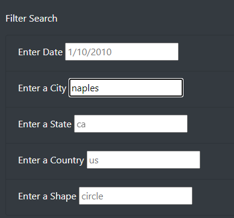

# UFOs
### Project Overview
Dana is a data analyst that is writing about the topic of her choice, her hometown and UFOs. The only thing she has to go on is a JavaScript file full of the information. She wants to display the data as a table and manipulate the table by applying filters using JavaScript. Since she's posting the article online she wants to put everything in a HTML file that will contain her article, the table of data and easy to use filters.

### Resources
- Date Source: data.js, app.js
- Languages: HTML, JavaScript, CSS
- Software: Visual Studio Code v 1.75.1, Google Chrome v 100.0.5481.104

### Results
Dana, here you will see that someone visiting your site can filter their search by date, city, state, country and shape of the object, using one at a time or multiple filters at once.  The format in which the visitor preforms their search does matter so they will need to follow the example that is in the corresponding search bar. Once the search criteria is entered the user will only have to press the enter key and the filter will be executed, no press of a button necessary. To filter the search by city, for example, Naples, FL, the user would enter "naples" in the search box labeled "Enter a City".

In the next example, the user performed a search just by the state of California, they entered "ca" in the "Enter a State" search box. It was decided this still returned too many results so they entered the city of El Cajon as well, and then filtered by date. Narrowing the search down on three criteria.

### Summary
A drawback to this new design is the lack of a "Search" button. Many people, when visiting a website look for a button to push to complete the task after filling in a text box. This
can often confuse people, and some may turn away from the website.

Recommendations for clarity:
1. Turn the words "Filter Search" into a clickable button that will filter all boxes at the same time.
2. Another option would be to have one input box just labeled "Search" for the user to enter their criteria.
3. Additionally, we may be able to filter each column by making a drop down filter box appear when clicked.
